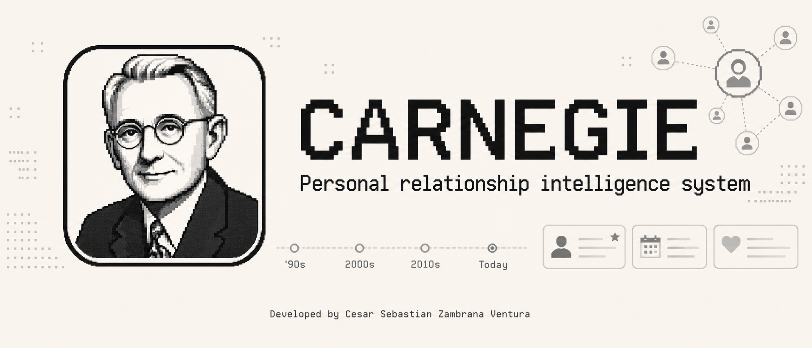
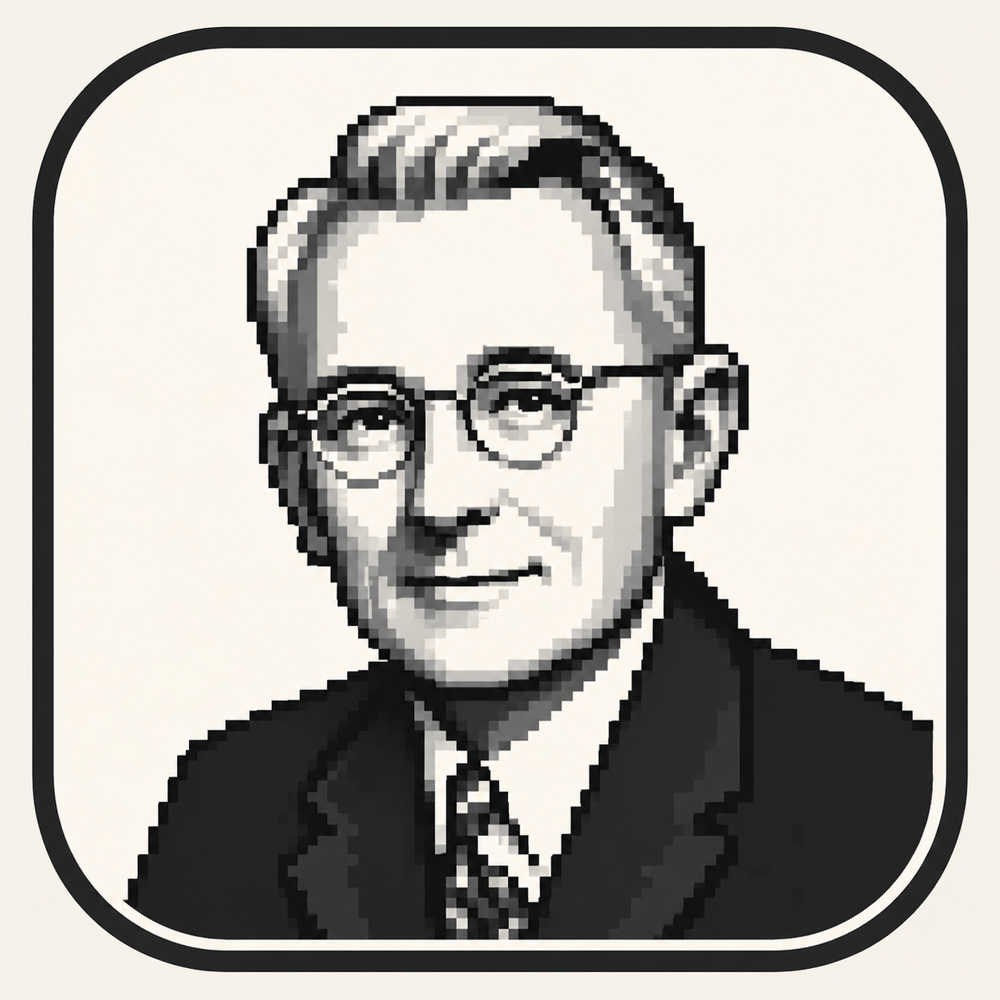

# Carnegie

**Carnegie** is a private personal CRM for remembering people, relationship
context, and meaningful interactions over time.

It is for people who want a calmer way to care for personal and professional
relationships without depending on memory, spreadsheets, or public social
platforms.

## Mission

Carnegie gives relationship context a private home. The product promise is
simple: help people remember who matters, what matters to them, and what has
happened over time, while keeping the experience quiet and personal.

## Who it is for

- People who maintain meaningful personal and professional relationships.
- Independent consultants, operators, founders, advisors, and community builders
  who need memory without a social feed.
- Anyone who wants relationship recall to feel intentional instead of noisy.

## Product Principles

- Private by default: relationship memory is personal.
- Calm before comprehensive: the experience should reduce cognitive load.
- Human context over contact records: notes should preserve meaning, not just
  facts.
- Useful over time: the system should help people return to context when it
  matters.

## Use Cases

- Remember personal details before a conversation.
- Keep track of meaningful meetings, calls, and moments.
- Revisit how a relationship has changed over time.
- Maintain a private relationship memory separate from public platforms.

## Trust Posture

This public landing page intentionally stays high-level. It does not describe
private operating details or copyable internals. Carnegie should be evaluated
here by its mission, audience, product promise, and care for privacy.

## What Carnegie Is Not

- Not a social network.
- Not a public contact directory.
- Not a sales automation feed.
- Not a replacement for consent, judgment, or care in real relationships.

## Languages

Carnegie introduces itself in U.S. English and neutral Latin American Spanish.

## Public Promise

Carnegie's public message stays high-level: a private, calmer way to remember
relationship context without turning people into a feed.

